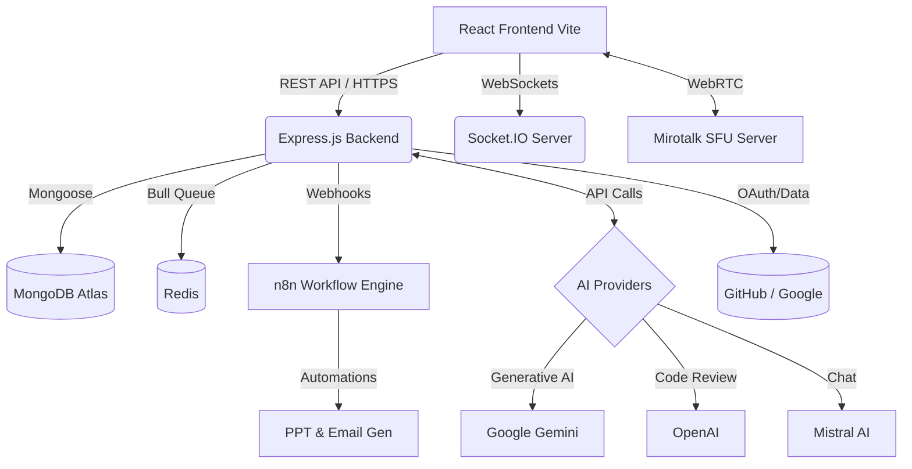
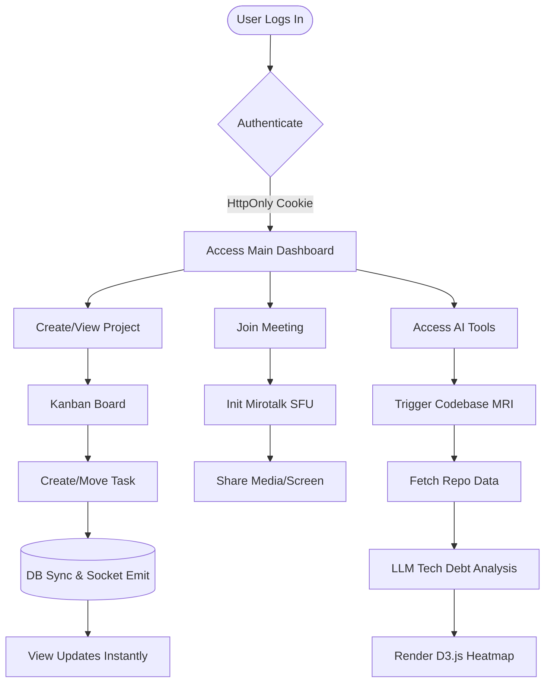
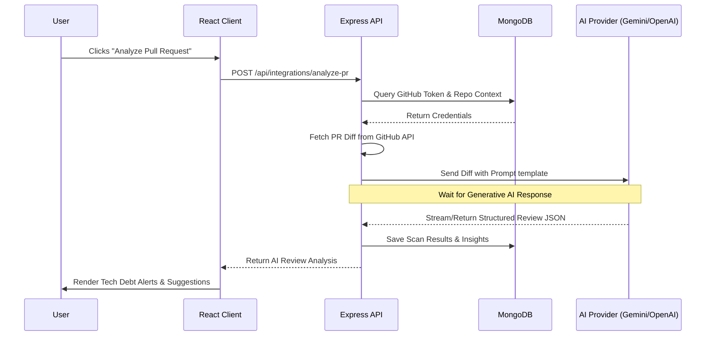

# Understanding Digital Dockers Suite

## 1. Project Title & Tagline
**Digital Dockers Suite** - *An AI-Powered Enterprise Workplace Automation Platform*

## 2. Problem Statement
Modern software engineering teams suffer from severe context-switching and tool fatigue. Project management occurs in Jira, code reviews on GitHub, video meetings on Zoom/Teams, tech debt analysis on SonarQube, and workplace automation requires disparate SaaS tools. This fragmentation leads to communication silos, overlooked technical debt, and a significant drop in developer productivity and team velocity.

## 3. Proposed Solution
**Digital Dockers Suite** provides a deeply unified, single-pane-of-glass platform that merges robust Agile project management with advanced AI intelligence and real-time collaboration. By embedding AI-driven Codebase MRI (health scanning), WebRTC video conferencing (Mirotalk SFU), Socket.IO live chat, and n8n workplace automation directly into the project workspace, teams can plan sprints, track capacity, review code, and automate repetitive tasks without ever leaving the ecosystem.

## 4. Objectives & Goals
*   **Consolidate Workflows:** Eliminate tool sprawl by providing a centralized hub for project management, communication, and documentation.
*   **Surface Technical Debt:** Use AI to automatically scan and visualize code complexity, churn, and security risks (Codebase MRI).
*   **Enhance Collaboration:** Provide seamless, built-in communication via live chat, collaborative spaces, and self-hosted WebRTC video conferences.
*   **Automate Routine Operations:** Leverage n8n workflows to automate pitch deck (PPTJS) creation, email drafting, and intelligent RAG-based document parsing.
*   **Security First:** Ensure robust security using enterprise-grade strict HttpOnly Cookie authentication via Passport.js.

## 5. Technical Stack
*   **Frontend:** React 19, Vite 7, Material UI 7, Ant Design 6, TailwindCSS, Framer Motion, D3.js / Recharts (Visualizations), ReactFlow.
*   **Backend:** Node.js, Express 5, MongoDB (Mongoose 9).
*   **Real-time & Video:** Socket.IO 4 (Chat/Notifications), Mirotalk SFU / Mediasoup (WebRTC Video Conferencing).
*   **AI Models:** Google Gemini AI, Mistral AI, OpenAI, LangChain.
*   **Automation & Queueing:** n8n (Workflows), Bull (Redis-backed Job Queue), Puppeteer, Sharp.
*   **Authentication:** Passport.js (Google OAuth 2.0, Microsoft, Local Strategy with HttpOnly Cookies).

## 6. Key Features
*   **Project & Sprint Management:** Full Kanban boards, subtask hierarchies, automated work logs, and dynamic sprint burndown charts.
*   **Codebase MRI & Gatekeeper Stream:** AI-driven heatmaps visualizing tech debt across connected GitHub repositories, coupled with automated AI PR reviews.
*   **Mirotalk SFU Integration:** High-performance, low-latency video meetings hosted directly within the platform.
*   **AI Chatbot & RAG:** Context-aware AI assistants that can query uploaded workspace documents (PDF/DOCX) using Retrieval-Augmented Generation.
*   **Smart Tasks & Reassignment:** AI algorithms that detect workload imbalances and suggest smart task reassignments.
*   **Workplace Tools:** Meeting schedulers, automated PPT generation, and team wellness check-ins.

---

## 7. Deep Feature Breakdown (End-to-End Analysis)

This section provides an exhaustive, granular look at every functional module within the Digital Dockers Suite.

### 7.1 Agile Project Management Core
*   **Sprint Planning & Backlog:** Users can create Sprints, define start/end dates, and move tickets from an overarching Backlog into active sprints. The backlog supports Epics to group related tasks over longer roadmaps.
*   **Kanban Board (Drag-and-Drop):** The core active workspace. Tasks (`IssueType: Bug, Story, Task`) can be dragged across customizable columns (`To Do, In Progress, Review, Done`). The board operates in real-time via `Socket.IO`, ensuring that if Developer A moves a ticket, Developer B sees it instantly without refreshing.
*   **Subtask Hierarchies & Dependencies:** Complex tasks can be broken down into Subtasks (via `SubTaskCreationModal`). The system tracks parent-child relationships, preventing a parent task from being closed if subtasks remain open.
*   **Work Logs & Time Tracking:** Developers can log hours spent on specific tasks. A built-in Global Timer allows users to hit "Start" when working on a ticket, which automatically compiles a work log entity upon stopping, feeding into burndown metrics.
*   **Roadmap & Epics:** A dedicated `RoadmapPage.jsx` renders Gantt-style charts to visualize Epic progression over months/quarters.

### 7.2 AI Project Architect (The Auto-Planner)
*   **CV Parsing & Skill Extraction:** Managers can upload employee resumes (PDF). `cvParserService` extracts the text, and `nvidiaLLMService` (running Llama 3) parses it into structured JSON arrays of technical skills (e.g., `["React", "Node", "MongoDB"]`).
*   **AI Sprint Formation:** A manager types a raw idea ("Build a real-time messaging module"). The AI breaks this down into "Technical Nodes", evaluates all parsed employee CVs, and automatically generates precise Subtasks assigned to the best-fit developers based on their exact skill overlap.
*   **Emergency Task Re-allocation:** A cron job (`reminderService`) scans for off-track tickets due in 48 hours. If found, the AI scans the team's workload and skills, offering a one-click "Swap Assignee" proposal via the `ReallocationProposalPanel`.

### 7.3 Codebase MRI (Technical Debt Visualizer)
*   **GitHub Repository Sync:** Users link GitHub repositories via `RepoConnectionBar`. The backend fetches the repository tree using the Octokit API.
*   **Complexity & Churn Heatmaps:** The system analyzes files for complexity and churn (frequency of commits). Using `D3.js` (`HeatmapMatrix.jsx`), it renders a thermal map of the codebase. Red zones indicate highly complex, frequently modified files (high risk of bugs).
*   **Automated Code Smells:** The backend uses static analysis (`typhonjs-escomplex`) to calculate Halstead metrics and Cyclomatic Complexity, exposing hidden technical debt.

### 7.4 Gatekeeper Stream (AI Pull Request Reviewer)
*   **Webhook Integration:** Listens to GitHub webhook events for new Pull Requests.
*   **AI Review Generation:** Retrieves the `git diff` of the PR and sends it to OpenAI (`prAnalysisService.js`). The AI evaluates logic flaws, performance bottlenecks, and security vulnerabilities.
*   **Inline Feedback:** The AI's feedback is mapped directly to the problematic lines of code and rendered in a unified diff viewer (`PRDetailModal`) directly within the Digital Dockers dashboard.

### 7.5 Real-Time Communication & Collaboration
*   **Socket.IO Live Chat:** Global and room-based text chats. Supports rich text, emojis, and file attachments.
*   **Spaces:** Distinct organizational areas (e.g., "Engineering Space", "Marketing Space") where teams can share generic posts, comments, and files outside of strict task tickets.
*   **Mirotalk SFU Video Conferencing:** A deeply integrated WebRTC server (`mirotalksfu` module running on port 3010). Teams can instantly launch peer-to-peer or server-forwarded secure video calls, complete with screen sharing, chat, whiteboard, and recording capabilities.

### 7.6 Workplace Automation & Tools
*   **Meeting Scheduler:** Users can schedule upcoming meetings, invite team members, attach agendas, and generate generic Google Meet/Zoom links alongside the native Mirotalk option.
*   **n8n Workflow Webhooks:** 
    *   **PPT Generator:** Users input a project summary; the backend fires a webhook to an `n8n` workflow that uses `PptxGenJS` to compile and return a downloadable `.pptx` presentation.
    *   **Auto Email Sender:** AI drafts professional emails based on brief context prompts, routing through `Nodemailer`.
*   **Document Management & RAG:** Users upload enterprise documents. The backend parses them (PDF/Word), chunks the text, and stores embeddings. Users can then "chat with their documents" using Retrieval-Augmented Generation to instantly find policies, specs, or guidelines.

### 7.7 Administration & Analytics
*   **Role-Based Access Control (RBAC):** Distinct UX/UI flows for `Admin`, `ProjectManager`, `TeamLead`, and `Developer`.
*   **Workload Dashboard:** Managers view a matrix of every employee's current story point allocation to prevent burnout.
*   **Wellness Check-ins:** A daily popup asks developers how they are feeling (stress levels, blockers). This data is anonymized and fed back to PMs to gauge team morale.
*   **Reports Generation:** `Chart.js` powered graphs that visualize Sprint Velocity, Bug-to-Feature ratios, and individual developer output over custom date ranges.

---

## 7. Implementation Methodology
The project follows a modular, monolithic architecture housed in a monorepo structure, optimized for parallel development via `concurrently`. 
*   **Client-Server Separation:** The React frontend operates independently, proxying API requests to the Express backend.
*   **Event-Driven Architecture:** Socket.IO handles live updates (board movements, chat messages) to ensure all connected clients remain synchronized.
*   **Microservice Extensibility:** Video routing is offloaded to the Mirotalk SFU server, while complex background automations are delegated to an external n8n instance and Bull worker queues.
*   **AI Orchestration:** Backend services aggregate contextual data before securely querying large language models (LLMs) via LangChain abstractions.

## 8. Results & Performance Metrics
*   **Real-Time Sync:** Socket.IO ensures sub-100ms latency for cross-client Agile board updates.
*   **Video Concurrency:** Mediasoup-backed Mirotalk SFU allows dozens of concurrent high-quality video streams with minimal CPU overhead due to its selective forwarding architecture.
*   **AI Processing:** Fast asynchronous background processing via Bull minimizes user-facing loading times during deep repository scans or RAG document ingestion.
*   **Scalability:** Stateless API design (with session data stored in secure cookies/Redis) allows horizontal scaling of the Node.js backend under extreme enterprise loads.

## 9. Conclusion & Future Scope
Digital Dockers Suite successfully bridges the gap between project management, code intelligence, and team communication. 
**Future Scope:**
*   **CI/CD Pipeline Integration:** Direct integration with Jenkins/GitHub Actions to block deployments based on Codebase MRI threshold failures.
*   **Auto-Healing Code:** Expanding the AI to not just identify tech debt, but automatically generate exact Pull Requests with refactored code.
*   **External ERP Integrations:** Syncing workload data with enterprise systems like SAP, Oracle, or Salesforce for wider company resource planning.

---

## 10. Required Technical Diagrams

### 10.1 System Architecture Diagram
This diagram illustrates the high-level infrastructure, showing how the client interacts with the Node API, which in turn acts as a gateway to Databases, AI Providers, and secondary services (Mirotalk, n8n).

### 10.2 User Flow Diagram
A step-by-step visual map of a typical user adopting the platform, creating a project, gaining insights, and leveraging AI tools.

### 10.3 Sequence Diagram
This sequence maps the exact interaction path when an AI-powered code review (Gatekeeper) is requested.

